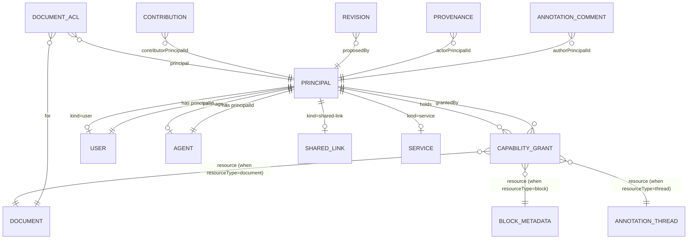

# ADR-0002: 权限模型 —— Capability + Principal + 同步网关

- **Status**: Proposed
- **Date**: 2026-05-08
- **Phase**: 0（关键路径 D2）
- **Deciders**: <项目所有者>
- **Gated on**: ADR-0001（数据模型）已 Proposed；本 ADR 接受不需等原型，但实现要等 Phase 1 同步网关写出来才正式生效

---

## 1. Context

`paper-platform-system-prompt.md` 第一性原理 #9 直接说："**协作是动词，不是名词**……简单的 RBAC + 单一 history timeline 是死路一条。" §2 进一步要求"User 与 Agent 同等公民，权限是 capability-based"。

但 Yjs 没有内建权限。Liveblocks 只有房间级。Y-Sweet 只有 doc 级 token。所有方案都要求 **自建网关层鉴权**。这意味着 Phase 0 必须把权限抽象设计对，否则 Phase 1 的同步网关只能裸跑——后期再补则要回头改 schema、改协议、改所有调用点。

本 ADR 的边界：

- **决定**：完整 capability 词汇表；Phase 1 默认 5 个 role；Principal 模型的实现细节；网关执行策略（连接级 vs 节点范围）的 Phase 1 / Phase 3 时间表；3 个 Phase 3 场景走查。
- **不决定**：JWT 签发库（better-auth vs Lucia 等）—— ADR-0003 决定；MCP server 注册接口 —— Phase 1 ADR；具体 capability 检查算法（用 Cedar / OPA / 自写）—— Phase 1 实现选择。

**Prior art**：
- Linear 早期 RBAC → capability 重构（公开记录里有"我们后悔没第一天就 capability"）
- AWS IAM 的 verb × resource × condition 模型（参考词汇粒度）
- Cedar Policy Language（AWS 推出，verb-resource-actor 表达力强）
- better-auth `organization` plugin（roles + member capabilities）

---

## 2. Decision

### 2.1 Capability 词汇表（动词 × 资源）

**词汇规则**：
- 形式：`<resource>.<verb>[:<scope>]`
- `<scope>` 可选，用于消歧（例：`agent.invoke:citation` vs `agent.invoke:editor`）
- 不超过 50 条；Phase 0 锁定 36 条；Phase 1+ 增量加（每加一条要在 ADR 中追溯）

**完整列表（36 条）**：

#### Document 层（10 条）

| Verb | 含义 |
|---|---|
| `document.read` | 读文档 body + metadata |
| `document.read:metadata-only` | 只读 metadata（标题、作者列表），不能看 body |
| `document.create` | 创建新文档 |
| `document.delete` | soft delete |
| `document.export` | 导出 MyST/LaTeX/Word/JATS/Markdown |
| `document.fork` | fork 出讨论分支或变体 |
| `document.merge` | 把 fork 的修改 merge 回原文档 |
| `document.transfer-ownership` | 转移 ownerPrincipalId |
| `document.archive` | 归档 |
| `document.publish` | 发布（公开 URL 可见） |

#### Block 层（8 条）

| Verb | 含义 |
|---|---|
| `block.read` | 读某 block 内容（粒度：可对单个 block 授权） |
| `block.propose` | 提议修改（产 Revision） |
| `block.commit` | 直接编辑提交（产 Contribution，不走 review） |
| `block.review` | 对他人 Revision 投票 accept/reject/modify |
| `block.create` | 在文中插入新 block |
| `block.delete` | 删除 block |
| `block.move` | 改变 block 顺序（移动） |
| `block.lock` | 锁定 block（其他人不能 propose / commit） |

#### Annotation 层（5 条）

| Verb | 含义 |
|---|---|
| `annotation.read` | 读 thread + comments |
| `annotation.create` | 创建 thread + 第一条 comment |
| `annotation.reply` | 在已有 thread 里加 comment |
| `annotation.resolve` | 标记 thread 已解决 |
| `annotation.delete` | 软删 comment（标记，内容仍在 audit） |

#### Citation 层（4 条）

| Verb | 含义 |
|---|---|
| `citation.read` | 读 citation metadata（默认对所有读者开放） |
| `citation.create` | 创建 global citation 记录 |
| `citation.update` | 修改 citation metadata（错误更正） |
| `citation.bind` | 把 citation 绑定到某 block（产 citation-ref） |

#### Agent 层（5 条）

| Verb | 含义 |
|---|---|
| `agent.register` | 注册新 agent（platform / user / org level） |
| `agent.invoke:editor` | 唤起 editor agent |
| `agent.invoke:reviewer` | 唤起 reviewer agent |
| `agent.invoke:citation` | 唤起 citation agent |
| `agent.invoke:custom` | 唤起 user 自建 agent（受 Agent.allowedMcpServerIds 限制） |

> Phase 1 不会全部用上 5 个 invoke verb——Phase 1 范围只到 inline 改写 + 单 DOI 核查（即 `agent.invoke:editor` 与 `agent.invoke:citation`）。其余从一开始就在词汇表里，避免 Phase 2 加 reviewer/researcher agent 时还要 bump capability schema。

#### Provenance 层（2 条）

| Verb | 含义 |
|---|---|
| `provenance.read` | 读取 contribution 的来源链 |
| `provenance.read:agent-detail` | 读 AgentExecutionContext 全字段（含 promptHash / inputSkillIds） |

> 这两条独立是因为：评审者可以看到"这是 AI 改的"（`provenance.read`），但不一定有权看到具体用了什么 prompt（`provenance.read:agent-detail`）。Phase 2 起开放科学场景下后者会更频繁开放。

#### Capability 元层（2 条）

| Verb | 含义 |
|---|---|
| `capability.grant` | 给他人授权 |
| `capability.revoke` | 撤销授权 |

> 谁能 grant 什么，由"grantor 自己有的 capability 的子集"决定（默认规则）。Phase 1 简化：只有 document owner 能 grant。

### 2.2 Phase 1 默认 5 个 role（capability bundle）

Role 不是 schema 概念，只是一组 `CapabilityGrant` 的便利打包。Phase 1 默认创建文档时按"作者 + 评论者"两种 role 分发。

#### Role 1: `paper-author`（合著者）

```
全部 document.* （除 transfer-ownership / publish 仅 owner）
全部 block.*
全部 annotation.*
全部 citation.*
agent.invoke:editor, agent.invoke:citation
provenance.read, provenance.read:agent-detail
capability.grant, capability.revoke (限于自己授出去的)
```

#### Role 2: `paper-reviewer`（评审者）

```
document.read
block.read, block.propose, block.review
annotation.* (所有讨论)
citation.read
agent.invoke:editor (只在自己提议的 revision 上用)
agent.invoke:citation
provenance.read, provenance.read:agent-detail
```

> 关键：reviewer **没有** `block.commit`，所有改动只能通过 propose → owner accept 路径。

#### Role 3: `commenter`（仅评论者）

```
document.read
block.read
annotation.read, annotation.create, annotation.reply
citation.read
provenance.read
```

#### Role 4: `inline-editor-agent`（绑定 Agent.principalId）

```
block.read, block.propose
agent.invoke:editor (元能力：可以 self-invoke)
provenance.read (限自己产的)
```

> 默认 propose-only，不能 commit。"自主修改"模式下用户显式给 `block.commit:scope=<block-id>` 的临时授权（capability grant 带 expiresAt）。

#### Role 5: `citation-agent`（绑定 Agent.principalId）

```
block.read (限 citation-ref atom node 及上下文 ±2 段落)
block.propose (限 citation-ref 的 attrs.citationId 修改)
citation.read, citation.create, citation.update
agent.invoke:citation
provenance.read (限自己产的)
```

> Citation Agent 的 read scope 收窄到"引用本身和上下文"——不让它读全文。这是 system-prompt §7"AI agent 不能默认看到全部内容"的实现。

### 2.3 Principal 模型实现细节

格式约定（PrincipalId 字符串前缀编码 kind，避免 join）：

```
PrincipalId = 'user:<uuidv7>' | 'agent:<uuidv7>' | 'link:<uuidv7>' | 'service:<short-id>'
```

**为什么前缀编码**：JWT claim 里 `sub: 'agent:abc...'` 网关层一行 `claim.sub.startsWith('agent:')` 就知道身份类别，**无需** join `principal` 表。这对每个 WebSocket 帧都要鉴权的热路径是关键优化。

**Principal 生命周期**：

| Action | 触发 |
|---|---|
| 创建 user Principal | 用户注册 |
| 创建 agent Principal | Agent 实体创建时同步 |
| 创建 link Principal | document owner 生成共享链接 |
| 创建 service Principal | platform 服务（如 export worker）启动时一次性 |
| revoke Principal | revokedAt 字段；revoke 后所有 capability grant 自动失效 |

> **shared-link Principal**：Phase 1 不实现共享只读链接，但 schema 第一天就含 `kind: 'shared-link'` ——避开 Phase 2 加链接共享时的 schema migration（Linear 早期就栽过这个坑）。

### 2.4 同步网关执行策略（Phase 1 / Phase 3 时间表）

**Phase 1（连接级鉴权）**：

```
[Client] ──(WebSocket handshake with JWT)──▶ [sync-gateway]
                                              │
                                              ├─ verify JWT signature
                                              ├─ extract sub (PrincipalId)
                                              ├─ load capability set for (principalId, documentId)
                                              ├─ require: document.read AT MINIMUM
                                              ├─ classify connection mode:
                                              │    - if has block.commit → "writer"
                                              │    - if has block.propose → "proposer"
                                              │    - else → "reader"
                                              └─ proxy Y.Doc traffic with mode-based filter:
                                                   - reader: only receive updates, send rejected
                                                   - proposer: send goes to "draft revision" Y.Map, not body
                                                   - writer: full bidirectional
```

**Phase 1 局限**：连接级 = 整个文档。不能在同一连接里"section A 可写、section B 只读"。这是已知 trade-off。Phase 3 解锁。

**Phase 3（节点范围鉴权）**：

```
- Document 拆 Yjs subdocuments（每章一个 subdoc，或每个权限范围一个）
- 每个 subdoc 单独 token / capability check
- 网关用 capability resourceType='block' resourceId=<blockId> 控制 atom-level 写入
- 大文档（>50 协作者）转向 awareness reducer，gossip 只广播最近活跃 12 个 cursor
```

**网关 shim 必须 Phase 1 就在**——即便 Phase 1 只用连接级鉴权，shim 接口（`canApplyUpdate(principalId, documentId, update) → boolean`）必须存在；Phase 3 升级是替换实现，不是加新概念。这是为什么 D6 ADR-0003 把 sync gateway 列为独立 app（`apps/sync-gateway`），而非塞进 web。

### 2.5 ER 图



**`document_acl` 表**（Phase 1 引入，简化 capability 检查的热路径）：

```ts
// Optional Phase 1 optimization: materialized view of capability bundles per (principal, document)
// to avoid full capability_grant scan on every WebSocket frame.
export interface DocumentAcl {
  documentId: DocumentId;
  principalId: PrincipalId;
  roleId: 'paper-author' | 'paper-reviewer' | 'commenter' |
          'inline-editor-agent' | 'citation-agent' | 'custom';
  // Materialized capability set (denormalized from capability_grant)
  capabilityVerbs: string[];
  expiresAt?: IsoDateTime;
}
```

> Phase 0 不实现 ACL 表；Phase 1 加速热路径时引入，触发器从 `capability_grant` 同步。

---

## 3. 三个 Phase 3 场景走查

每个场景必须 **不需要新概念** 就能在现有词汇 + Principal 模型里描述。如果哪个场景描述不出来，本 ADR 设计失败。

### 场景 A：50 人开放评审综述

**情境**：Document owner（A）发布"开放评审"链接，希望任何 ORCID 验证用户（B 类，预期 ~50 人）能提议改动；A 团队（含 reviewer C）批量 review。

**用现有抽象能否描述**：

```
A ─ paper-author Role
  ├─ 全部 document.* / block.* / capability.grant ...

C（reviewer）─ paper-reviewer Role
  ├─ document.read, block.propose, block.review, ...

B 类（50 个开放贡献者）─ 自定义 role 'open-reviewer'
  ├─ document.read
  ├─ block.read, block.propose
  ├─ annotation.create, annotation.reply
  ├─ citation.read
  └─ provenance.read
```

**关键操作**：A grant 'open-reviewer' role to 50 个 ORCID-verified users（capability_grant 表 50 × N rows，N 是 capability bundle size）。

**Phase 1 网关行为**：50 个 B 用户 WebSocket 连入时分类为 "proposer"——它们的 Y.Doc 写都重路由到 `draft revision` Y.Map，不动 body。A 和 C 看到所有 draft revisions，批量 review。

**没有需要新概念**——open-reviewer role 是 paper-reviewer 的精减版，capability 词汇全部覆盖。✓

### 场景 B：评审者派外部 AI agent，scope 到 section 3 + propose-only

**情境**：评审者 C 想派一个外部 AI agent（C 自己的 OpenAI account 跑的，不在 platform 控制下）来审 section 3——agent 不能看其他章节、只能 propose 不能 commit、用完 timeout 自动 revoke。

**用现有抽象能否描述**：

```
C 注册 agent X：Agent { runtime: 'client', principalId: 'agent:x...' }
  → X 自动获得 'inline-editor-agent' role（默认）

C 给 X 临时授权（在 X 的默认 role 之外）：
  capability_grant rows:
    - principal: 'agent:x...'
      resourceType: 'block', resourceId: <section-3-block-ids>
      verb: 'block.read'
      expiresAt: now + 1h
    - principal: 'agent:x...'
      resourceType: 'block', resourceId: <section-3-block-ids>
      verb: 'block.propose'
      expiresAt: now + 1h
  
  注意：没有 grant block.commit、没有 grant 全文 block.read
```

**关键约束**：
- Agent X 网关连接时只能拉 section 3 的 block 内容（Phase 3 subdocument 隔离自然实现；Phase 1 网关需要"只读 + 子集"模式过滤——这是 Phase 1 → Phase 3 的过渡复杂度）
- Agent X 的 propose 必须经 C review 才能转 Revision（`agent.invoke:custom` 的输出默认 status='draft'）
- 1 小时后 expiresAt 触发，capability_grant 失效，agent 连接被踢

**没有需要新概念**——`Agent.principalId` + capability_grant.expiresAt + resourceType='block' 全部已在。✓

> **Phase 1 局限**：Phase 1 网关连接级鉴权下，agent X 实际能看到全文（连接级是整个 document）。这是已记录的 known limitation——必须在 Phase 1 ADR 里明说"用户挂自己的 agent 时数据访问粒度只到 document 级，章节级隔离 Phase 3"。**避免 Phase 1 把"章节隔离"作为卖点**。

### 场景 C：Fork-and-merge 工作流

**情境**：作者 D 看到 paper P，fork 出讨论分支 P'，邀请 5 人讨论变体；几周后想把 P' 的改动 merge 回 P（与 P 原作者 A 协商）。

**用现有抽象能否描述**：

```
D forks P → creates P' with:
  - new Document row, ownerPrincipalId = D (not A)
  - same body content (initial Y.Doc copied)
  - Document.forkedFromContributionId = <P's latest contribution> (字段加在 Phase 1 的 ADR-0001 拓展)
  
D's 5 friends 在 P' 上：D grants 'paper-author' role on P' to each

D wants to merge P' back to P:
  - D needs 'document.merge' on P (不是 P')
  - A 给 D grant 'document.merge' (限 P)
  - merge UI 计算 P' 的 contribution sequence vs P 的 contribution sequence
    → 用 PM steps rebase 算法 (revision-based merge)
  - 冲突 block 上 D 看到"两个版本"，UI 引导手动选择
```

**Capability 是否够**：
- `document.fork` ✓ 已在
- `document.merge` ✓ 已在
- 没有需要 "merge.review" / "merge.accept" 这类细分——merge 本身就是一次 commit，受 `block.commit` 约束（只有 P 的 author 能最终 commit）
- D 不能在 P 上 commit（除非 A 给 D paper-author），所以 D 的 merge 实际是"提议 merge"——产生一组 Revision（P' 的每个 commit 对应一个 P 上的 Revision），A 批量 review

**新增字段**（不算新概念，是 Document 字段补充，留 Phase 1 ADR 推进）：
- `Document.forkedFromContributionId?: ContributionId`
- `Document.forkedFromDocumentId?: DocumentId`

**没有需要新 capability 词汇**。✓

---

## 4. Consequences

### Good

- **Capability 词汇 36 条覆盖** Document / Block / Annotation / Citation / Agent / Provenance / 元，三个 Phase 3 场景全部可描述
- **Principal 前缀编码**（'user:' / 'agent:'）让网关热路径无需 DB join，性能可控
- **Role 是 capability bundle** 而非 schema 实体——Phase 2/3 加新 role 不动数据库结构
- **网关 shim 接口提前抽象**（Phase 1 连接级实现，Phase 3 节点级实现），避免 Phase 3 重写网关
- **shared-link Principal kind 第一天就在**——避开 Linear 早期 Permission 重构的坑
- **"AI 显式授权范围"**通过 `Agent.principalId` + `capability_grant.resourceType=block` + `expiresAt` 自然实现，符合 system-prompt §7

### Bad / Trade-offs

- **Phase 1 章节级隔离不可用**——connection 级是整个 document。**对策**：明确文档化为 Phase 1 limitation；不把章节隔离作为 Phase 1 卖点；Phase 3 ADR 时 Yjs subdocument 拆分 + token 重换。
- **`document_acl` 表是 denormalization** ——`capability_grant` 是 source of truth，`document_acl` 是物化视图（trigger 同步）。Phase 1 加 ACL 表时要确保 trigger 正确，否则会有 split-brain bug。**对策**：Phase 1 ADR 写 reconcile job（每小时全量重建 ACL）作为 backstop。
- **`expiresAt` 检查频率** ——50 协作者场景下，每帧检查 expiresAt 不可行。**对策**：连接握手时检查 + 每 60s 心跳重检 + grant revoke 主动 broadcast 强制断开。
- **Capability 词汇收口要严**——35 条是有意收紧的；每加一条要追溯 ADR。**对策**：词汇表存 `packages/permissions/src/capabilities.ts`（Phase 1 引入），所有代码必须 import 这里的常量，不能手写字符串字面量。
- **没用 OPA / Cedar** ——自写 capability 检查器（Phase 1 ~150 行 TS）。**对策**：检查器写得简单 + 大量单元测试；如果 Phase 4 词汇爆炸（>80 条 + 复杂条件），再迁移到 Cedar。

### Neutral / Need watching

- **5 个 default role 是否正好**——可能需要拆 `paper-reviewer` 出 "blind-reviewer"（看不到作者身份）。Phase 2 实测后定。
- **`capability.grant` 谁能 grant 什么** —— Phase 1 简化为 "只有 owner"；Phase 2 起需要"grantor 必须自己有这个 capability 才能 grant"的递归规则（不复杂但要实现）
- **JWT 内嵌 capability 还是只嵌 PrincipalId** —— Phase 1 倾向只嵌 PrincipalId（JWT 短，capability 在网关查 cache）；如果 capability lookup 成为热路径，再考虑 JWT 内嵌（最多 ~2KB token）。

---

## 5. Alternatives considered

### A. **简单 RBAC（owner / editor / reviewer / viewer 4 个 role）**

**为什么不选**：第一性原理 #9 直接禁止。3 个 Phase 3 场景中场景 B（外部 agent + scope + propose-only + expiresAt）无法用 4-role 模型描述——它需要"agent 这个 principal 在某些 block 上有某些 capability，1 小时后失效"，这是 capability + scope + TTL 的三维问题。

### B. **OPA / Cedar 从 Phase 1 起用**

**是什么**：用现成 policy engine 而非自写检查器。

**为什么不选（Phase 1）**：(1) 36 条词汇 + 简单 verb-resource 检查不需要 policy DSL；(2) OPA/Cedar 引入运行时依赖 + policy 语法学习曲线；(3) Phase 1 自写检查器可读、可单测；(4) Phase 4 如果词汇 80+ 条 + 复杂条件，再迁过去。

### C. **Capability 嵌 JWT，无 DB lookup 热路径**

**是什么**：把整个 capability set 序列化进 JWT claim，网关连接时一次解析。

**为什么不选（默认）**：(1) JWT size 风险（50 协作者 × document_acl rows 的 capabilities 可能大到几 KB）；(2) revoke 必须等 JWT 过期，无法立即生效——open peer review 场景下不能接受；(3) JWT TTL 必须很短（<5 min），续 token 频繁。**保留作为 Phase 2 优化**——若 capability lookup 真成瓶颈，再考虑 hybrid（JWT 嵌核心 verb，扩展 verb 走 lookup）。

### D. **Permissions 直接挂在 User 上，Agent 用 OAuth-like 委托**

**为什么不选**：违反 system-prompt §2 "User 与 Agent 同等公民"。"委托"模型让 agent 只是 user 的代理，无法表达"agent 有自己的能力边界"——system-prompt 第一性原理 #11 要 provenance 区分 user 与 agent 行为。Principal 抽象一视同仁是核心结构。

---

## 6. Decision log

- **2026-05-08**: 词汇收口到 36 条（不超过 50）。原因：每加一条 capability 都要写 migration、训练 reviewer、更新 default role bundles。设计时反复问"这真是新动词，还是已有词汇的 sub-case？"
- **2026-05-08**: 决定 `document_acl` 是 Phase 1 优化，不是 Phase 0 schema 概念。原因：避免 Phase 0 实现 trigger 复杂度；capability_grant 已经是 source of truth。
- **2026-05-08**: 决定 Phase 1 网关连接级 = 整个 document，节点范围留 Phase 3。原因：Yjs 单 doc + 子 doc 拆分对 ProseMirror 集成有额外复杂度（y-prosemirror 不直接支持 subdoc-per-section），D3 不验证 subdoc，Phase 1 不引入。**显式记录为 Phase 1 limitation**，不作为 marketing。
- **2026-05-08**: 决定 `agent.invoke:<scope>` 用 `:<scope>` 后缀消歧而非各自独立 verb。原因：词汇压缩；后缀模式与 AWS IAM `s3:GetObject` 类似，可读。

---

## 7. References

- ADR-0001（数据模型）—— Principal / Agent / Capability / Block 等定义
- `plan0/paper-platform-system-prompt.md` §2, §7（协作主体多元 / 隐私）
- `plan0/phase-0-execution-plan.md` D2 章节
- AWS Cedar Policy Language: https://www.cedarpolicy.com/
- better-auth organization plugin: https://better-auth.com/docs/plugins/organization
- Linear 早期 Permission 重构（公开博客 / talks 中提到）
